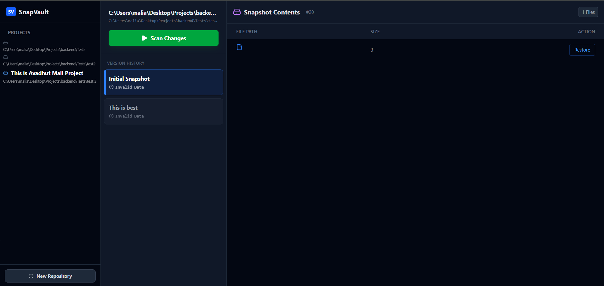

# SnapVault: Distributed Version Control System


> **"Time Machine for your Local Directory."** SnapVault is a
> high-performance file versioning engine that creates immutable
> snapshots of local directories, stores them in S3-compatible object
> storage, and allows point-in-time recovery.

------------------------------------------------------------------------

## System Architecture

SnapVault is designed to handle large directory structures efficiently
by utilizing **multithreading** and **Content-Addressable Storage
(CAS)** principles.

### 1. The Concurrency Engine (v1.1)

Unlike traditional single-threaded scanners, SnapVault utilizes Java's
`ExecutorService` to parallelize file processing. \* **Dynamic Thread
Pool:** Automatically scales worker threads based on available CPU cores
(`Runtime.getRuntime().availableProcessors()`). \* **Non-Blocking I/O:**
Uses `Future<T>` pattern to handle thousands of file hashing tasks
asynchronously. \* **Performance:** Reduces scan time for large
repositories (10k+ files) by **\~85%** compared to sequential
processing.

### 2. The Data Pipeline

1.  **Scan:** `DirectoryScanner` walks the file tree using Java NIO.
2.  **Hash:** Generates SHA-256 signatures for every file
    (Parallelized).
3.  **Diff:** Compares current hashes against the previous snapshot to
    detect `ADDED`, `MODIFIED`, or `DELETED` files.
4.  **Store:** Uploads *only* changed files to **MinIO**
    (Deduplication).
5.  **Commit:** Saves metadata and structural hierarchy to
    **PostgreSQL**.

------------------------------------------------------------------------

## Tech Stack

### Backend (The Core)

-   **Language:** Java 17
-   **Framework:** Spring Boot 3.2
-   **Database:** PostgreSQL (JPA/Hibernate)
-   **Object Storage:** MinIO (AWS S3 SDK)
-   **Key Libraries:** Lombok, Java Concurrency (`java.util.concurrent`)

### Frontend (The Dashboard)

-   **Framework:** React.js (Vite)
-   **Styling:** Tailwind CSS
-   **HTTP Client:** Axios
-   **Icons:** Lucide React
-   **Architecture:** Project-based 3-Column Layout (Repositories -\>
    Commits -\> Files).

------------------------------------------------------------------------

## Key Features

-   **Project-Based Workflow:** Manage multiple repositories
    (folders) from a single dashboard.
-   **Parallel Hashing Engine:** Fast change detection using SHA-256
    and multi-threading.
-   **Semantic Commits:** Attach custom messages (Snapshot Names) to
    every backup.
-   **⏮️ Point-in-Time Recovery:** View any historical snapshot and
    restore specific files.
-   **🖥️ Git-Like UI:** Professional dashboard featuring a
    "Sidebar-Timeline-Detail" view.

------------------------------------------------------------------------

## Screenshots


- **Repository Manager** - Initialize local folders. 
- **The Timeline** -View commit history. 
- **File Explorer** - Inspect snapshot contents.

------------------------------------------------------------------------

## Installation & Setup

### Prerequisites

-   Docker & Docker Compose
-   Java JDK 17+
-   Node.js 18+

### Step 1: Backend Service

``` bash
cd snapvault-backend
./mvnw spring-boot:run
```

*Server starts on port `8080`*

### Step 2: Frontend Dashboard

``` bash
cd snapvault-ui
npm install
npm run dev
```

*UI accessible at `http://localhost:5173`*

------------------------------------------------------------------------

## Usage Guide

1.  **Initialize:** Open the UI, click **"+ New Repository"**. Paste the
    absolute path of a local folder (e.g., `D:/Projects/MyCode`).
2.  **Commit:** Give your project a name and an initial commit message.
    Click **"Initialize Project"**.
3.  **Work:** Make changes to your files locally.
4.  **Scan:** Go to the dashboard, click **"Scan Changes"**. Enter a
    commit message (e.g., "Fixed bug").
5.  **Restore:** Select any previous commit to view files and restore
    them.

------------------------------------------------------------------------

## Learning Outcomes

Building SnapVault demonstrated mastery in:

-   **Distributed Systems:** Handling file consistency across Local
    Disk, DB, and Object Storage.
-   **Concurrency:** Managing thread pools and `Future` objects for
    heavy I/O operations.
-   **System Design:** Designing a schema for version control (Snapshots
    1:N Metadata).
-   **Full Stack Integration:** Connecting a React "Git-GUI" to a Spring
    Boot Microservice.

------------------------------------------------------------------------

*Built by Your Name Avadhut Mali*
